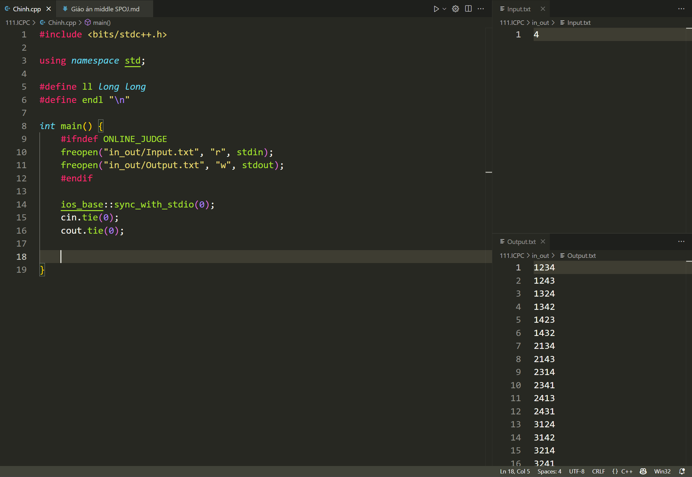

# Midle SPOJ: Visual Code Studio & Giải đáp thắc mắc
***Tác giả: Hoàng Văn Chính D23***

- [Midle SPOJ: Visual Code Studio \& Giải đáp thắc mắc](#midle-spoj-visual-code-studio--giải-đáp-thắc-mắc)
  - [A. Mục tiêu](#a-mục-tiêu)
  - [B. Yêu cầu chuẩn bị (Người dạy)](#b-yêu-cầu-chuẩn-bị-người-dạy)
  - [C. Yêu cầu chuẩn bị (Người học)](#c-yêu-cầu-chuẩn-bị-người-học)
  - [D. Tiến trình bài giảng](#d-tiến-trình-bài-giảng)
    - [I. Lý do chuyển sang VS Code](#i-lý-do-chuyển-sang-vs-code)
    - [II. Giới thiệu chung](#ii-giới-thiệu-chung)
    - [III. Đặc điểm nổi bật](#iii-đặc-điểm-nổi-bật)
      - [1. Hỗ trợ đa nền tảng](#1-hỗ-trợ-đa-nền-tảng)
      - [2. Hiệu suất cao và nhẹ](#2-hiệu-suất-cao-và-nhẹ)
      - [3. Kho tiện ích mở rộng phong phú](#3-kho-tiện-ích-mở-rộng-phong-phú)
      - [4. IntelliSense - Gợi ý mã thông minh](#4-intellisense---gợi-ý-mã-thông-minh)
      - [5. Terminal tích hợp](#5-terminal-tích-hợp)
    - [IV. Sử dụng VS Code](#iv-sử-dụng-vs-code)
      - [1. Một số kiến thức cơ bản](#1-một-số-kiến-thức-cơ-bản)
      - [2. IntelliSense trong VS Code](#2-intellisense-trong-vs-code)
      - [3. Một số phím tắt trong VS Code](#3-một-số-phím-tắt-trong-vs-code)
      - [4. Giới thiệu một số extension thường dùng](#4-giới-thiệu-một-số-extension-thường-dùng)


## A. Mục tiêu
1. Chuyển sang Visual Code Studio
2. Dùng VS Code sao cho tối ưu cho giải thuật
3. Giải đáp thắc mắc sau 2 tuần SPOJ

## B. Yêu cầu chuẩn bị (Người dạy)
1. Đọc, nghiên cứu kĩ giáo án vì đây là giáo án mới
2. Vì buổi này khá nặng lý thuyết dạy chính nên share màn hình từ đầu buổi, giảng đến đâu thực hành đến đấy.


## C. Yêu cầu chuẩn bị (Người học)
1. Tìm hiểu và tải Visual Code Studio về máy
2. Cài đặt môi trường cho code C/C++

## D. Tiến trình bài giảng
Hướng dẫn nhanh nếu các em chưa cài được hoặc đang bị lỗi (ưu tiên cài bằng MSYS2 và thiết lập môi trường user variables): https://www.youtube.com/watch?v=Gwix4rtQpdk&t=469s
> Câu hỏi: Tại sao lại phải cài đặt MinGW và thiết lập môi trường trong environment variables để chạy file C/C++?

**Trả lời: MinGW là bộ công cụ giúp biên dịch C/C++ trên Window. Khi chạy chương trình hệ thống sẽ tìm kiếm chương trình biên dịch nằm trong biến môi trường `Path`. Vì vậy kể cả đã tải MinGW nhưng chưa dẫn vào `Path` thì Window sẽ không tìm thấy trình biên dịch và báo lỗi**

### I. Lý do chuyển sang VS Code
> Câu hỏi: Tại sao lại bắt đầu bằng Dev C++?

**Trả lời: Đơn giản, nhẹ, dễ cài đặt. Không có các tính năng nâng cao như IntelliSense giúp các em nhớ được cú pháp code, linh hoạt hơn khi làm bài kiểm tra trên trường (vì trên trường có thể không dùng được VS Code hoặc có VS Code nhưng chưa có extension mà mạng lại khá yếu nên tải mất nhiều thời gian)**

> Câu hỏi: Tại sao bây giờ lại cần chuyển sang VS Code?

**Trả lời:**
- **IntelliSense giúp nâng cao đáng kể tốc độ lập trình**
- **Hệ sinh thái extension khổng lồ**
- **Code được nhiều loại ngôn ngữ lập trình (Python, JavaScript,...) và ngôn ngữ đánh dấu như Markdown.**
- **Rất nhiều tính năng khác chờ các em khám phá ở khoá DSA**
- **Giao diện tuỳ biến theo sở thích**

### II. Giới thiệu chung
Visual Studio Code (VS Code) là một trình soạn thảo mã nguồn miễn phí và mạnh mẽ do Microsoft phát triển. Nó hỗ trợ nhiều ngôn ngữ lập trình, có khả năng mở rộng với các tiện ích (extensions) và tích hợp nhiều công cụ hỗ trợ lập trình viên.

### III. Đặc điểm nổi bật
#### 1. Hỗ trợ đa nền tảng
- Hoạt động trên Windows, macOS và Linux.
- Cung cấp khả năng đồng bộ hóa giữa các thiết bị.

#### 2. Hiệu suất cao và nhẹ
- Tốc độ khởi động nhanh, không tiêu tốn quá nhiều tài nguyên hệ thống.
- Hỗ trợ mở các dự án lớn mà không bị chậm.

#### 3. Kho tiện ích mở rộng phong phú
- Cho phép cài đặt nhiều extensions để hỗ trợ ngôn ngữ lập trình, công cụ debug, AI hỗ trợ code, v.v.
- Một số tiện ích phổ biến: C/C++ Extension Pack, CPH, Markdown All in One, Markdown Preview Enhanced,...

#### 4. IntelliSense - Gợi ý mã thông minh
- Hỗ trợ gợi ý cú pháp thông minh giúp lập trình nhanh và chính xác hơn.
- Có thể mở rộng với các extensions chuyên biệt cho từng ngôn ngữ.

#### 5. Terminal tích hợp
- Giúp chạy lệnh trực tiếp mà không cần mở terminal bên ngoài.

### IV. Sử dụng VS Code
#### 1. Một số kiến thức cơ bản
- Có thể dùng ctrl + N như DevC, code và ctrl + S để lưu file nhưng không khuyến khích lắm
- => Nên tạo một folder để quản lý
- Có dấu chấm trắng xuất hiện ở cuối của tên file có nghĩa là có một thay đổi gì đấy chưa được lưu.

- Có thể tìm hiểu thêm auto save khi save và khi paste
- Chỉnh themes, size chữ

#### 2. IntelliSense trong VS Code
IntelliSense là một tính năng hỗ trợ lập trình viên trong VS Code. Nó giúp tự động gợi ý code, giảm thiểu lỗi cú pháp, tăng tốc độ lập trình và cải thiện năng suất làm việc.

Nhưng chỉ có một số ngôn ngữ được hỗ trợ mặc định IntelliSense trong VS Code như:
- JavaScript
- TypeScript
- JSON
- CSS, SCSS, Less
- HTML

Còn đối với các ngôn ngữ khác thì phải tự cài thêm extension (đối với C/C++ )

#### 3. Một số phím tắt trong VS Code
- **Ctrl + /**: comment hoặc huỷ comment nhanh

- **Alt + Up/Down**: chuyển một hoặc nhiều dòng code lên hoặc xuống

- **Ctrl + Alt + Up/Down**: Tạo nhiều con trỏ từ tâm điểm ban đầu
- **Alt + Click**: Tạo nhiều con trỏ ở những vị trí click
- **Highlight + Tab**: Thêm tab vào nhiều dòng

- **F2**: Thay đổi tên biến nhanh. Đặt con trỏ chuột vào biến cần thay đổi và ấn F2 (chú ý không tô đậm, chỉ đặt con trỏ chuột).

- **Shift + Alt + F**: format document. Format nhanh toàn bộ file code
  - Mặc định thì sẽ sắp xếp dấu `{` theo kiểu `Allman` (`{` xuống dòng mới)
  - Nếu muốn đổi thành kiểu `Attach` (`{` cùng một dòng với câu lệnh)
  - Thêm dòng sau vào `Open user setting(JSON)`: 

```
"C_Cpp.clang_format_style": "{ BasedOnStyle: Google, IndentWidth: 4 }"
```

#### 4. Giới thiệu một số extension thường dùng
- C/C++ Extension Pack
- CPH (nói luôn về file input, output)

- Markdown All in One
- Markdown Preview Enhanced
- ...
